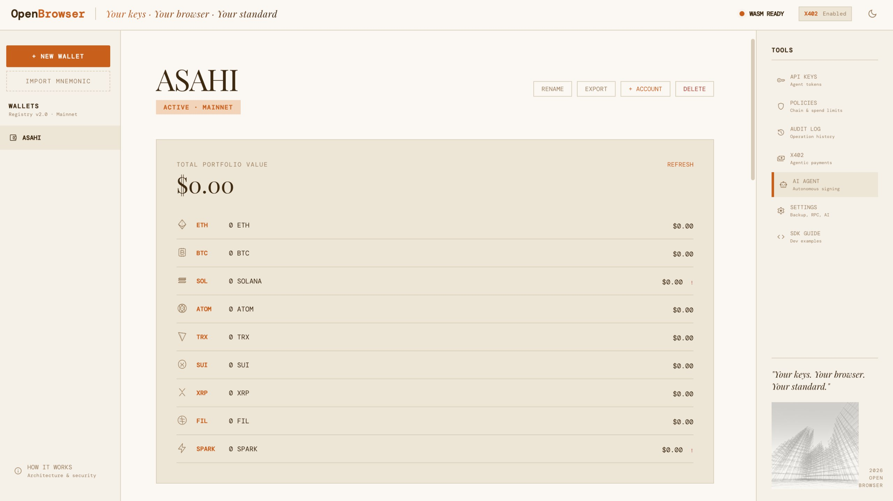

# Open Browser

Non-custodial, multi-chain wallet with AI agent. Runs entirely in your browser via WebAssembly.

Built on [Open Wallet Standard (OWS)](https://github.com/open-wallet-standard/core). Vault v2 format, scrypt KDF, 9-chain HD derivation, X402 agentic payments. Fully compatible with OWS CLI.

<p align="center">
  
</p>

## Why Open Browser?

Most wallets trust a server with your keys. Open Browser doesn't.

Everything -- key generation, signing, encryption -- happens inside a WebAssembly sandbox in your browser. Your private keys never touch the internet. Signing happens on your CPU, not on someone else's server.

No account. No backend. No custody. No trust required.

## Run Locally

```bash
git clone https://github.com/Bihruze/open-browser.git
cd open-browser
npx serve . -p 3000
```

Open http://localhost:3000 -- your wallet is ready.

> Three commands. No signup. No install. No server. Everything runs on your machine.

---

## For Users

### Getting Started

```
Step 1                  Step 2                  Step 3
+---------------+      +---------------+      +---------------+
| + New Wallet  |  ->  | Save your     |  ->  | Wallet ready  |
|               |      | 12 words!     |      | 9 addresses   |
| Name: ____    |      |               |      |               |
| Pass: ____    |      | abandon ...   |      | ETH: 0x7...   |
| [Create]      |      | [Verify 3]    |      | BTC: bc1q..   |
+---------------+      +---------------+      | SOL: 7Ec...   |
                                               +---------------+
```

1. Click **+ New Wallet** in the sidebar
2. Enter a wallet name and a strong passphrase
3. **Write down your 12-word recovery phrase** on paper. It will not be shown again
4. Verify 3 randomly selected words to prove you saved it
5. Your wallet is ready with addresses on 9 chains

### Receive Crypto

1. Select a chain tab (ETH, BTC, SOL, ATOM, TRX, SUI, XRP, FIL, SPARK)
2. Your address and QR code appear automatically
3. Copy the address and send funds from an exchange or another wallet

### Send ETH

1. Select the **ETH** chain tab
2. Enter recipient address and amount
3. Click **Estimate Fee** to preview gas cost
4. A confirmation card shows from, to, amount, fee, total
5. Confirm. Transaction is signed in WASM and broadcast to Ethereum mainnet
6. Track your pending transaction with live status updates

### Import Existing Wallet

Already have a wallet from OWS CLI, MetaMask export, or another BIP-39 source?

1. Click **Import Mnemonic** in the sidebar
2. Paste your 12 or 24 word recovery phrase
3. Set a passphrase. Same mnemonic produces same addresses on all 9 chains

### AI Agent

Connect an AI provider (OpenAI, Claude, Gemini, DeepSeek, or Groq) and talk to your wallet:

- `"check my ETH balance"` -- instant
- `"check my SOL balance every 5 minutes"` -- scheduled task
- `"alert me when ETH below 0.5"` -- conditional notification
- `"sign message 'hello' on solana"` -- signs with your key
- Or ask anything. The AI decides what actions to take

Your API key stays in your browser. Never sent to our servers.

### X402 Agentic Payments

When an API returns HTTP 402 Payment Required, Open Browser automatically signs an EIP-3009 USDC TransferWithAuthorization and retries the request. AI agents can pay for API access without human intervention.

### Tools

| Tool | What It Does |
|------|-------------|
| **API Keys** | Create tokens for apps/agents to access your wallet with limited permissions |
| **Policies** | Set rules: which chains allowed, spending limits, expiry dates |
| **Audit Log** | View every operation performed. Export as JSONL for compliance |
| **X402** | Test HTTP 402 agentic payments. Auto-pay APIs with USDC |
| **Settings** | Backup/restore vault, manage contacts, configure RPC endpoints, AI provider |
| **AI Agent** | Autonomous wallet assistant powered by LLM |
| **SDK Guide** | Code examples for developers integrating Open Browser |

### Security

Your private keys never leave the WASM sandbox. Signing happens on your CPU.

- Scrypt (N=65536) + AES-256-GCM encryption
- IndexedDB only. Never localStorage
- Keys zeroed from memory when you close the tab
- OWS CLI vault v2 compatible
- Content Security Policy enforced
- Constant-time token comparison
- Policy engine with fail-closed unknown rules

---

## For Developers

Open Browser is also an SDK. Other projects can build on top of it.

### Install

```bash
npm install @open-browser/sdk
```

### Quick Start

```javascript
import init, { create_wallet, sign_message } from '@open-browser/sdk';

await init(); // Load WASM once

const wallet = await create_wallet("my-wallet", "strong-passphrase");
// wallet.accounts -> 9 chain addresses

const sig = await sign_message("my-wallet", "strong-passphrase", "evm", "Hello");
// sig.signature -> "0x..."
```

### Build On Top Of Open Browser

Open Browser is designed as a foundation. Import the SDK into your React, Next.js, Vue, or any web app:

```javascript
// Your DeFi app uses Open Browser for wallet operations
import init, { load_wallet, sign_typed_data } from '@open-browser/sdk';
import { getBalance } from '@open-browser/sdk/rpc';
import { fetchWithPayment } from '@open-browser/sdk/x402';

// Your AI agent uses Open Browser to pay for APIs
import { createSimpleAgent } from '@open-browser/sdk/agent';
import { chat } from '@open-browser/sdk/ai-provider';

// Your compliance tool uses Open Browser's audit trail
import { getAuditLog, exportAuditLog } from '@open-browser/sdk/audit';
```

### Core WASM Functions (11)

```javascript
// Wallet lifecycle
create_wallet(name, password)            // { id, name, mnemonic, accounts[] }
import_wallet(name, mnemonic, password)  // { id, name, accounts[] }
load_wallet(name, password)              // { id, name, accounts[] }
list_wallets()                           // ["name1", "name2"]
export_wallet(name, password)            // mnemonic string
delete_wallet(name)
rename_wallet(old, new, password)
derive_accounts(name, password, index)   // accounts[] at index N

// Signing
sign_message(name, password, chain, msg)        // { signature, recovery_id? }
sign_tx(name, password, chain, txHex)            // { signature, recovery_id? }
sign_typed_data(name, password, typedDataJson)   // { signature } (EIP-712)
```

### JS Modules (19)

```javascript
// Blockchain data
import { getBalance, getAllBalances } from '@open-browser/sdk/rpc';
import { fetchPrices, getPrice } from '@open-browser/sdk/price';
import { getHistory } from '@open-browser/sdk/history';

// Transactions
import { estimateEthFee, buildEthTransfer } from '@open-browser/sdk/tx-builder';
import { signAndSend } from '@open-browser/sdk/sign-and-send';

// Agentic commerce
import { fetchWithPayment, createX402Wallet } from '@open-browser/sdk/x402';

// Access control
import { createApiKey, signTypedDataWithApiKey } from '@open-browser/sdk/api-keys';
import { createPolicy, evaluatePolicies } from '@open-browser/sdk/policy';

// AI agent
import { createSimpleAgent, OWSAgent } from '@open-browser/sdk/agent';
import { chat, saveAIConfig } from '@open-browser/sdk/ai-provider';

// Infrastructure
import { logOperation } from '@open-browser/sdk/audit';
import { exportVaultBackup } from '@open-browser/sdk/config';
import { keyCache } from '@open-browser/sdk/key-cache';
```

Full API reference: [SDK.md](SDK.md)

### Example: AI Agent Auto-Pay with X402

```javascript
import init, { create_wallet, sign_typed_data } from '@open-browser/sdk';
import { fetchWithPayment, createX402Wallet } from '@open-browser/sdk/x402';

await init();
const agent = await create_wallet("agent", "secret");
const addr = agent.accounts.find(a => a.chain_id.startsWith('eip155')).address;

const wallet = createX402Wallet(addr, async (json) =>
  await sign_typed_data("agent", "secret", json)
);

// Server returns 402? SDK auto-signs USDC payment and retries
const data = await fetchWithPayment('https://ai-api.com/generate', {
  method: 'POST',
  body: JSON.stringify({ prompt: "Analyze this..." })
}, wallet);
```

### Example: React Hook

```javascript
import { useState, useEffect } from 'react';
import init, { load_wallet, sign_message } from '@open-browser/sdk';
import { getAllBalances } from '@open-browser/sdk/rpc';

function useWallet() {
  const [wallet, setWallet] = useState(null);
  useEffect(() => { init(); }, []);

  return {
    connect: async (name, pass) => {
      const w = await load_wallet(name, pass);
      setWallet({ name, pass, ...w });
    },
    sign: (chain, msg) => sign_message(wallet.name, wallet.pass, chain, msg),
    balances: () => wallet ? getAllBalances(wallet.accounts) : {},
    wallet,
  };
}
```

### Supported Chains

| Chain | Curve | Derivation Path | Balance | Send | Sign | History |
|-------|-------|----------------|:-------:|:----:|:----:|:-------:|
| Ethereum | secp256k1 | m/44'/60'/0'/0/{i} | Yes | Yes | Yes | Yes |
| Bitcoin | secp256k1 | m/84'/0'/0'/0/{i} | Yes | -- | Yes | Yes |
| Solana | ed25519 | m/44'/501'/{i}'/0' | Yes | -- | Yes | Yes |
| Cosmos | secp256k1 | m/44'/118'/0'/0/{i} | Yes | -- | Yes | Yes |
| Tron | secp256k1 | m/44'/195'/0'/0/{i} | Yes | -- | Yes | Yes |
| Sui | ed25519 | m/44'/784'/{i}'/0' | Yes | -- | Yes | Yes |
| XRPL | secp256k1 | m/44'/144'/0'/0/{i} | Yes | -- | Yes | Yes |
| Filecoin | secp256k1 | m/44'/461'/0'/0/{i} | Yes | -- | Yes | Yes |
| Spark | secp256k1 | m/84'/0'/0'/0/{i} | -- | -- | Yes | -- |

### Build from Source

```bash
# Prerequisites
curl https://rustwasm.github.io/wasm-pack/installer/init.sh -sSf | sh

# Build
wasm-pack build --target web --out-dir pkg --release

# Run
npx serve . -p 3000
```

### Browser Support

Chrome 57+ / Firefox 52+ / Safari 14.1+ / Edge 79+

Requires: WebAssembly, Web Crypto API, IndexedDB

---

## Architecture

```
+-------------------------+------------------------------+
|    Open Browser                                        |
+-------------------------+------------------------------+
|   Rust -> WASM          |   JavaScript (19 modules)    |
|   (528KB binary)        |                              |
|                         |   rpc.js      -> 9 chain RPC |
|   lib.rs     11 fn      |   price.js    -> CoinGecko   |
|   wallet.rs  9 chain    |   history.js  -> TX history  |
|   signer.rs  10 sign    |   tx-builder  -> ETH send    |
|   eip712.rs  EIP-712    |   x402.js     -> payments    |
|   crypto.rs  encrypt    |   api-keys.js -> tokens      |
|   storage.rs IndexDB    |   policy.js   -> rules       |
|                         |   audit.js    -> logging     |
|                         |   agent.js    -> AI runtime  |
|                         |   ai-provider -> 5 LLMs      |
|                         |   config.js   -> settings    |
|                         |   key-cache   -> zeroization |
+-------------------------+------------------------------+
|   IndexedDB (encrypted vault, scrypt + AES-256-GCM)    |
+--------------------------------------------------------+
```

## Built With

- [Open Wallet Standard (OWS)](https://github.com/open-wallet-standard/core) -- Vault format, signing interface, chain support
- [Rust](https://www.rust-lang.org/) + [wasm-pack](https://rustwasm.github.io/wasm-pack/) -- WebAssembly compilation
- [k256](https://crates.io/crates/k256) / [ed25519-dalek](https://crates.io/crates/ed25519-dalek) -- Cryptographic signing
- [@noble/hashes](https://github.com/paulmillr/noble-hashes) -- Scrypt KDF (vendored)
- [Tailwind CSS](https://tailwindcss.com/) -- UI styling
- [CoinGecko API](https://www.coingecko.com/en/api) -- Price data

## License

MIT
